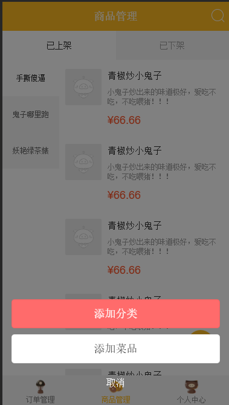
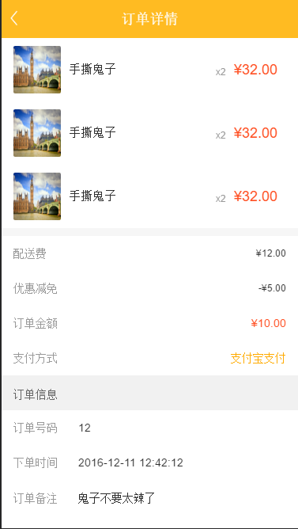

#####有Vue和Vux方面的问题可以共同探讨和学习，Vue的移动端项目可以关注微信公众号：猪猪的神奇外卖或猪猪集市，现在还是在主攻Android，有Android好的建议或问题也欢迎探讨！Arlen 736008081





#####下面是具体的配置：

##### 环境
 1. node v5.5.0
 2. npm 3.3.9

##### 技术栈

> [vue](https://github.com/vuejs/vue)

> [vue-router](https://github.com/vuejs/vue-router)

> [vue-resource](https://github.com/vuejs/vue-resource)

> [webpack](http://webpack.github.io/docs/)

> [vux](https://vuxjs.gitbooks.io/vux/content//)

> [es6-babel](https://babeljs.io/docs/learn-es2015/)


### 安装

通过`npm`安装本地服务第三方依赖模块(需要已安装[Node.js](https://nodejs.org/))，使用npm安装依赖模块可能会很慢，建议换成[cnpm](http://cnpmjs.org/)

```shell
npm install -g cnpm --registry=http://registry.npm.taobao.org
```

```bash
# 安装依赖模块
cnpm install

# 启动服务
npm run dev

# 发布代码
npm run build


```

### 开发

### 目录结构
<pre>
.
├── README.md
├── dist                     // 项目build目录（放生产环境）
├── build                    // 项目的配置文件目录
│   ├── dev-server.js        // 开发的服务配置
│   ├── webpack-dev-conf.js  // 开发的Webpack 配置文件
│   ├── webpack-prod-conf.js // 生产的Webpack 配置文件
│   ├── webpack-base-conf.js // 基本的Webpack 配置文件
├── index.js                 // 项目发布后的启动文件
├── package.json             // 项目配置文件
├── src                      // 生产目录
│   ├── assets               // css js 和图片资源
│   ├── data                 // 数据文件
│   ├── components           // 各种组件
│   ├── views                // 各种页面
│   ├── directives           // 各种指令
│   ├── filters.js           // 各种过滤器
│   ├── router.js            // 路由配置
│   └── main.vue             // 根组件
│   └── app.js               // Webpack 预编译入口
│   └── index.html           // 项目入口文件
.
</pre>
